<div align="center">

<!--
Generate assets:
python scripts/prep_photo.py <your-photo>
python scripts/make_ascii_svg.py
python scripts/make_info_card.py
-->

<h3><code>moanishkoya@github ~ $ ./contributions.sh</code></h3>



<br><br>

<h3><code>moanishkoya@github ~ $ whoami</code></h3>

<table>
<tr>
<td valign="top">

</td>
<td valign="top">

</td>
</tr>
</table>

<br><br>

<h3><code>moanishkoya@github ~ $ cat profile.txt</code></h3>

```text
Name      : Moanish Chowdary
Education : B.Tech CSE (3rd Year)
College   : Sreenidhi University
Focus     : Full-Stack Development • AI/ML
Learning  : System Design • Backend Engineering
Status    : Open to Software Engineering Internships
```

<br>

<p>
<b>Software Engineering Student · Full-Stack Developer · AI/ML Enthusiast</b>
</p>

<br>

[](https://github.com/moanishkoya)
[](https://www.linkedin.com/in/moanish-koya-7b3666337)
[](mailto:moanishkoya@gmail.com)

<br><br>

<h3><code>moanishkoya@github ~ $ ls featured-projects</code></h3>

<table>
<tr>
<td>🛡️ UPI Fraud Detection Platform</td>
<td>🏥 Hospital Management System</td>
</tr>
<tr>
<td>💰 Personal Expense Tracker</td>
<td>🤖 AI & Machine Learning Projects</td>
</tr>
</table>

</div>